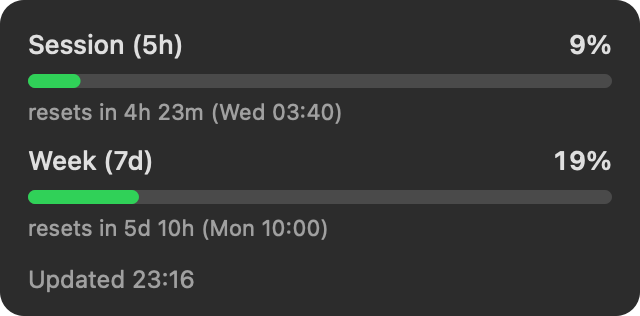

# Headroom

**Your Claude Code usage, live in your Mac's menu bar.**

Everyone on a Claude Pro/Max plan lives with two invisible meters — the 5-hour session
window and the 7-day weekly cap — and discovers them the bad way: a hard stop mid-task.
Headroom puts the number where ambient numbers belong:



- **Session (5h) and weekly (7d) utilization** as a live %, refreshed every minute
- **Color-coded before it bites** — calm below 70%, amber at 70%, red at 90%, tracking
  whichever window is closer to its limit
- **Reset countdowns** for both windows in the dropdown
- **Zero config.** No API key, no login, no settings. Install it and the number is there.

## Install

**[Download from headroom.walls.sh](https://headroom.walls.sh/download)** — free,
macOS 13+, universal (Apple Silicon & Intel), ~105 KB. Signed & notarized.

Unzip, drag `Headroom.app` to Applications, open it. On first launch Headroom explains
the one permission it needs, then macOS asks once (its standard Keychain dialog, for the
Claude Code token) — click **Always Allow** and it never asks again.

Or with Homebrew:

```sh
brew install --cask patwalls/tap/headroom
```

Or build it yourself in ~10 seconds:

```sh
git clone https://github.com/patwalls/headroom && cd headroom/app
swift build -c release && .build/release/Headroom
```

## How it works (the whole trick)

Claude Code already keeps an OAuth token in your macOS Keychain. Headroom reads it the
same way Claude Code does and asks Anthropic's usage endpoint for the same numbers
`/usage` shows. That's it — no scraping, no estimating, the real meters.

## The trust contract

An app that sits next to your credentials all day must be auditable. So:

- Your token is sent to **`api.anthropic.com` and nowhere else** — never logged, never
  written to disk, never phoned home. There are no analytics, no auto-updater, no
  network calls besides the one.
- The entire network + Keychain surface is one small file:
  [`app/Sources/Headroom/Usage.swift`](app/Sources/Headroom/Usage.swift). Read it.
- No dependencies. AppKit + Foundation, ~460 lines total.

## Built in public

Headroom is **Wall #003 of [walls.sh](https://walls.sh)** — built by an autonomous
loop, in public, toward one number: 100 stranger downloads. The North Star, the
milestone ladder, and every lap's log live in [`VISION.md`](VISION.md); how the loop
runs is in [`LOOP.md`](LOOP.md). The downloads counter on the wall is the site's own
[`/metrics`](https://headroom.walls.sh/metrics) — verification probes excluded.
